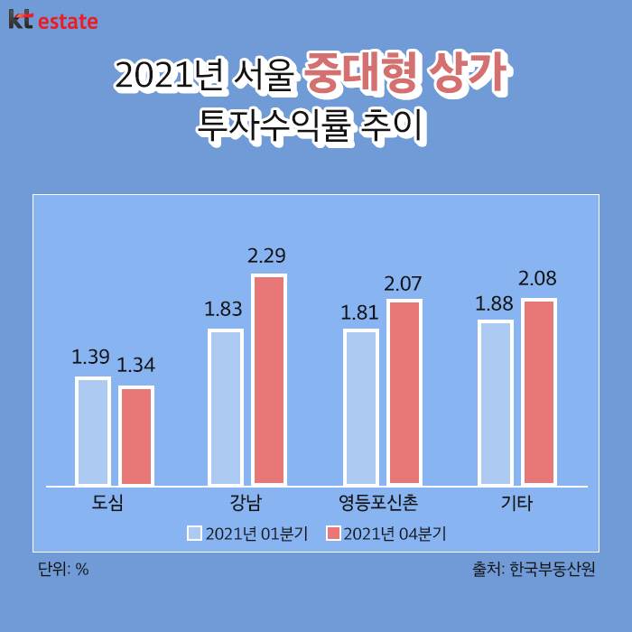

# 어떤 부동산 투자가 나에게 맞을까 -1

### 투자 수익 유형에 따른 부동산 투자 알아보기

---

### 수익 유형에 따른 부동산 분류

---

<aside>
💡 부동산의 수입 유형은 뭐가 있을까요?

</aside>

어떤 유형의 부동산 투자가 적합한지에 대해 이야기 하기 전에 우리가 부동산 투자로 기대할 수 있는 수익을 큰 카테고리로 나누자면 시세차익과 임대수익으로 나눌 수 있다. 어떤 것들이 있는지 먼저 체크 해보도록 하자.

### 시세차익

---

부동산을 매입할 때 가장 먼저 기대 할 수 있는 수익은 당연 `**시세차익**` 이다.

**아파트나 다세대, 단독주택 등이 일반적인 시세차익을 기대할 수 있는 대표적인 투자 자산들이며 상가투자, 주상복합, 꼬마빌딩 건물, 토지 들도 이에 해당**한다. 토지의 경우 매수하면 토지만으로는 거래가 활발하지 않고 일반적으로 토지 개발까지 고려하다보니 투자 난이도가 높은 편으로 이번 글에서는 내용에서 언급하지 않을 예정이다.

위 자산군들은 처음 산 시세보다 프리미엄이 붙은 가격에서 자산을 매각 했을 때 얻어지는 수익 이기 때문에 실현하는 데 까지 다소 시간이 소요된다는 점이 가장 큰 특징이라고 볼 수 있다.

**보편적인 사람들의 생각으로는 상가건물은 임대수입이 클거라고 생각하지만 현실은 이와 매우 다르다. 30억 이하의 상가건물에서 나오는 수익률은 3%는 커녕 2%의 수익률도 기대하기 힘들다.**

100억대 이상의 강남권의 상가들은 과거 5~10년 전에는 3~4%대의 평균 수익률을 기대 할 수 있었지만 현재는 2% 수준에 머물러 있다. 또한 매매가 자주 발생하지 않고 거래가 없다보니 시세가 잘 반영되지 않는 지역의 건물만이 조금 더 높은 수익을 기대할 수 있다.

이런 상가 건물들은 투자 단위가 크다보니 기타 대출이나 담보 대출로 레버리지를 크게 가져가는데 **가치 대비 70%는 흔하게 있고 8-90%까지 끼어서 거래되는 경우가 상당히 많다는 점을 염두** 해야한다.

보통 상가 건물주들보고 주님 위에 건물주 라며 임대료로 잘먹고 잘 살거라고 생각하는데 현실은 캐시카우가 있는 건물주가 아닌 이상 공실이 발생하면 당장 은행 이자를 걱정해야하는 임대인들이 더 많다는 거다.

레버리지가 높은만큼 위험이 크다고만 생각 할수도 있는데 시장이 호황기에 들면 또 다른 투자자가 그만큼 시세차익을 기대하고 실 투자금액은 적은 금액으로 투자할 수 있어 생각보다 접근성이 좋은 편이다. 투자금 대비 높은 수익을 기대할 수 있다는 장점이 있기 때문에 투자 리스크를 보고 단점만 있다고 말하기는 어렵다.

친한 세무사분 고객의 케이스를 들은 일례로 본인의 투자금은 하나도 들이지 않고, 담보 대출과 지인들의 투자금을 모두 모아서 100억이 넘는 건물을 매수한 사례가 있었는데, 1년내로 공실이 생기면서 투자자들에게 투자 수익금을 못 주는 상황까지 갔었다고 한다.

그렇게 사기꾼으로 몰릴뻔한 가운데 건물가치가 높게 평가되면서 대출 증액이 가능했고, 몇년내 매각하게 되면서 차익을 수십억원대를 만들었다고 한다.

아파트나 주택도 건물 거래 대비 금액은 작지만 마찬가지다. 일반적으로 임대수익보다는 시세차익을 노리는 투자로 전세같은 보증금까지 고려하면 레버리지가 보통 높은 편이여도 거래가 다른 부동산에 비해 활발하다. 난이도로만 보면 일반 주택들이 아파트에 비해 거래가 많지 않아 성사되기는 쉽지 않으나 구축 주택을 매수해서 인테리어나 보수를 잘 한다면 매매 차익을 기대할 수 있다.

최근 양도소득에 대한 중과세가 강화되고, 공시지가 현실화를 위한 상향, 법인에 대한 종합 부동산세 공제 폐지 등 여러 세금 관련 제도들이 개편되면서 부동산 투자 난이도는 최근 더 상당히 올라갔다고 볼 수 있다. 하지만 최근 여러 이슈들로 서울 주택 공급이 다소 늦어지면서 인플레이션과 더불어 가치 상승을 노릴만한 요소들도 있다.

과거에는 2-30대의 투자에 관심이 적었으나 최근 2년을 보았을 때 2-30대의 아파트 매수 비중은 전 연령대에서 30%에서 40% 대로 상승할 정도로 매우 가파르게 상승했다.

굉장히 공격적으로 투자하고 있다는 것을 알 수 있다. 현재 시점의 스코어로만 봤을 때 투자시기를 놓친 사람들에 비해 성공적인 투자였다고 볼 수 있지만 올해 금리가 큰 폭으로 오를거라는 악재도 같이 존재한다.

자산의 가치가 전고점에서 저점을 찍고 다시 전고점 회복까지의 기간을 투자업계에서는 보통 **`언더워터 기간`**(underwater period)이라고 부르는데 이를 버틸 수 있느냐가 시세 차익을 주 수입으로 하는 부동산 투자의 핵심이다.

역사적으로 한국의 부동산 투자는, 그 중에서도 서울 아파트와 상가 투자는 불패였다고 말해도 과언이 아닐 정도로 시장은 우상향 해온 것은 맞다. 다만 과거에 그랬다고 미래에도 그럴거라고 과연 말할 수 있을까 단순히 역사는 반복된다고? 근거없이 확신을 갖고 투자하는건 굉장히 위험한 생각일 수 있다.

자산 매수를 생각하면서 본인이 산 가치보다 미래에는 그 가치가 낮아질거라고 생각하며 사는 사람이 과연 있을까 아마도 없을 것이라 생각한다. 물론 예전처럼 사놓고 단순히 기다렸다가 파는 식의 buy and pray 로 손쉽게 수익을 보기는 다소 힘들어졌지만 저평가되어 있는 자산은 항상 있기 마련이다.

저평가 되어있는 자산을 고르는 안목은 어떻게 기를까?

본인이 관심있는 부동산 정보들을 수집해서 평가 요소들을 가지고 표를 만들고 현재 가치(net present value) 를 자신만의 방식으로 계산해 2년, 5년, 길게는 10년 후의 가치를 평가해보는 것을 추천한다.

단순하게 몇 차례 가치가 오르고 내리고를 맞췄다고 해서 안목이 높아졌다고 할 수는 없지만 본인이 생각했던 요소들이 실제로 영향이 있었는지, 그 외에 자산 가치에 영향을 준 부분들이 있었다면 왜 그런지에 대해 계속 공부 할 수 있는 계기가 될 것이다.

[시세차익을 주로하는 부동자산](https://www.notion.so/79a7a38f75934022b34101bbb1d3f910)

## 어떤 투자가 나에게 맞을까

---
